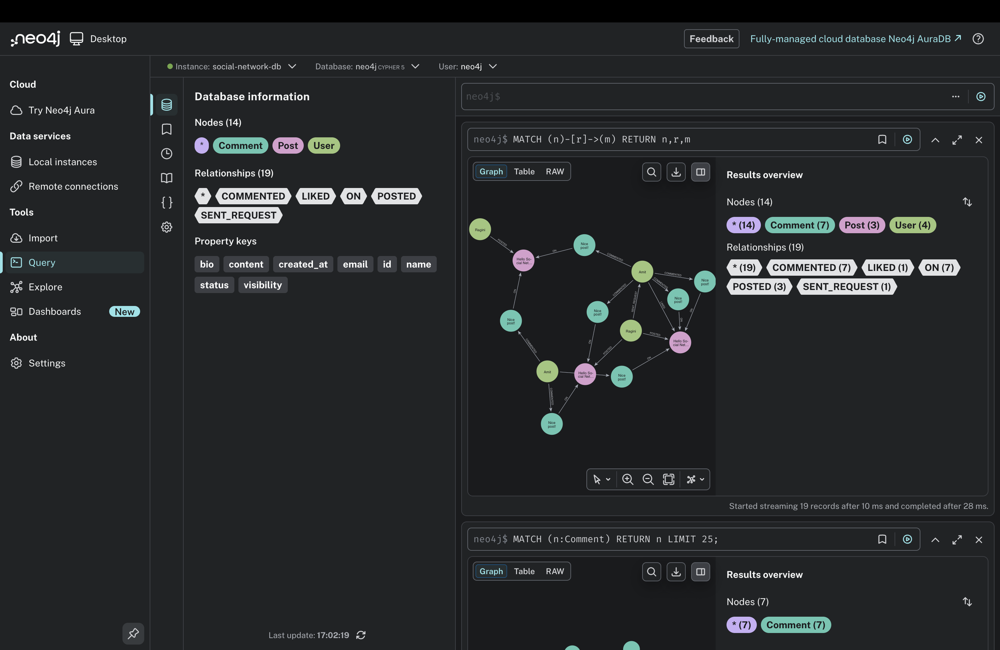
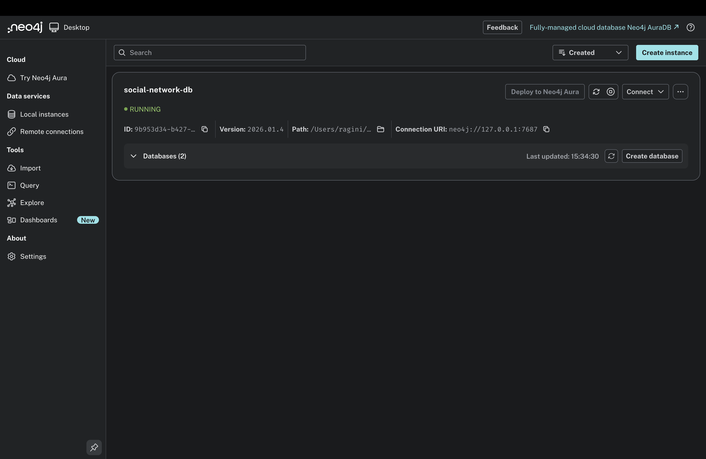
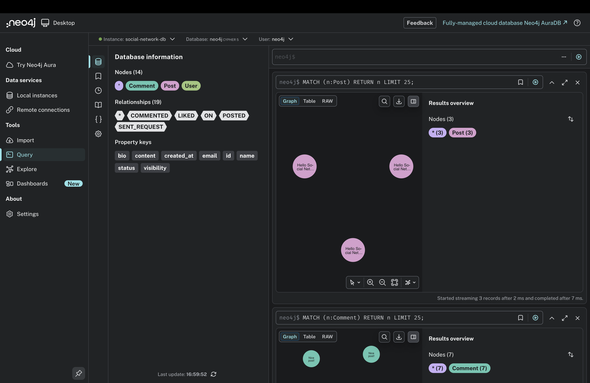
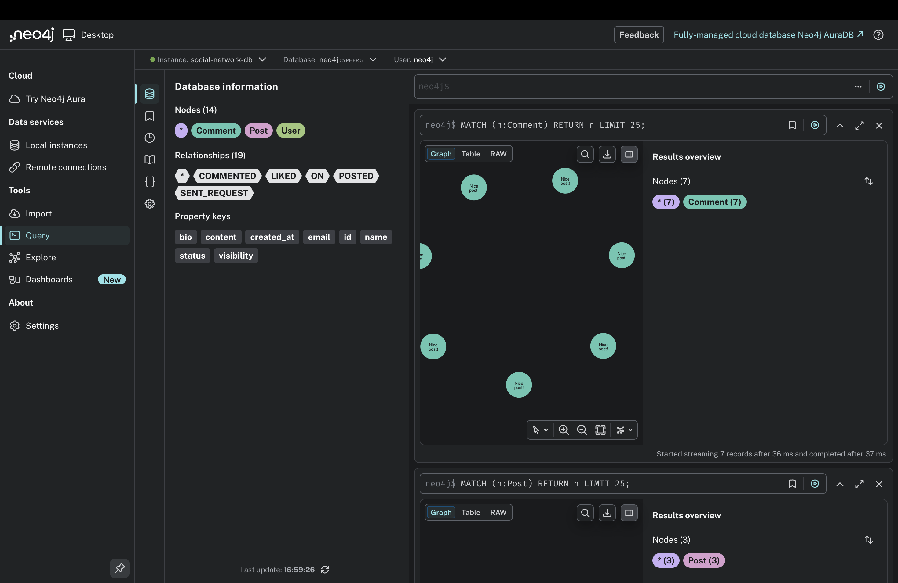
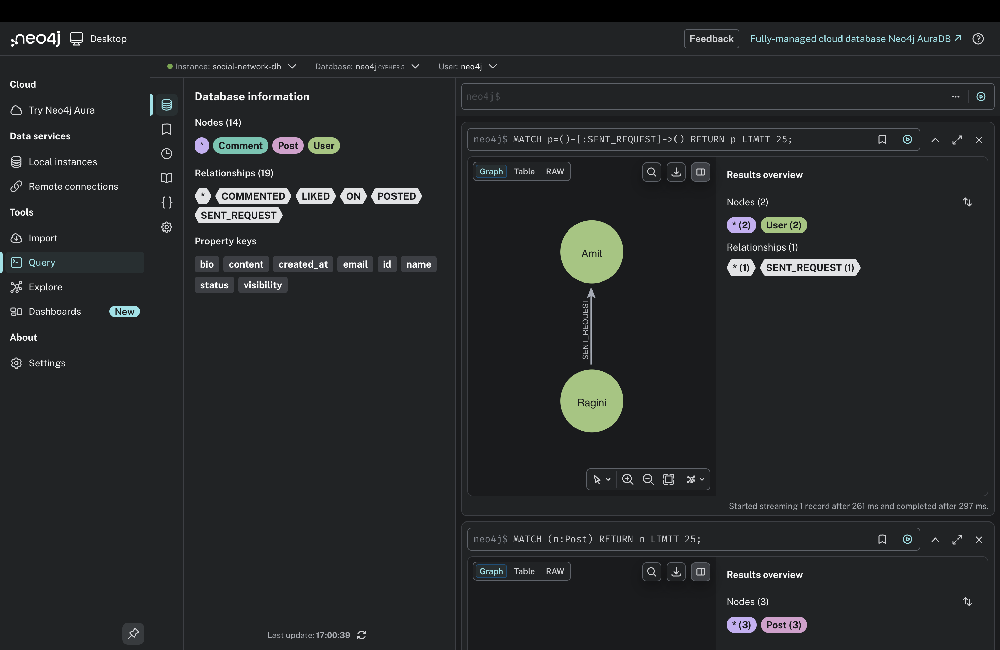
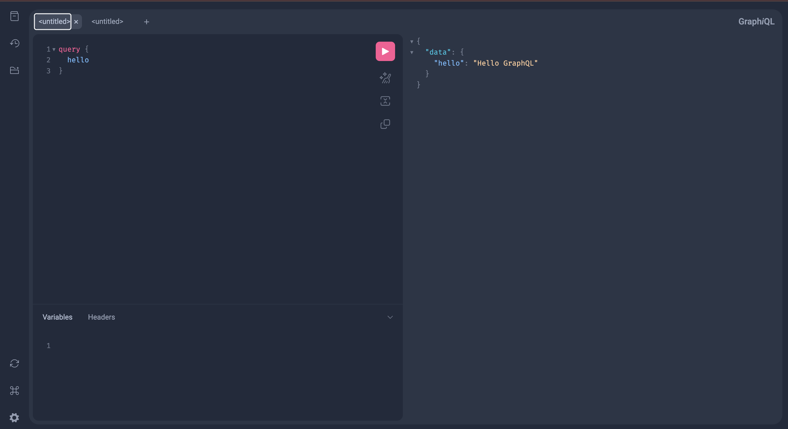
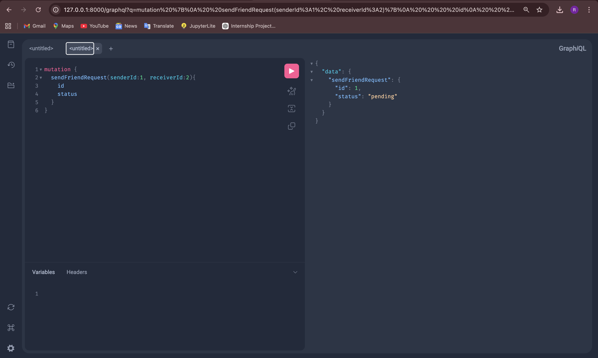

# GraphQL + Neo4j Social Network Case Study


## Project Overview

This project demonstrates the implementation of a **Social Network Management System using GraphQL and Neo4j Graph Database**.

Graph databases are designed to efficiently manage **highly connected data**, making them ideal for social network applications.

In this project, users can create posts, comment on posts, like posts, and send friend requests. Neo4j stores the data as nodes and relationships, while GraphQL provides a flexible API layer for querying and modifying the data.

---

## Technologies Used

* **Python**
* **FastAPI**
* **Strawberry GraphQL**
* **Neo4j Graph Database**
* **Cypher Query Language**
* **GraphQL Playground**

---

## Features

* Create Users
* Create Posts
* Comment on Posts
* Like Posts
* Send Friend Requests
* Graph Visualization using Neo4j
* GraphQL Query Execution
* GraphQL Mutation Execution

---

## Graph Data Model

The system includes the following entities:

* **User**
* **Post**
* **Comment**
* **FriendRequest**
* **Like**

### Relationships

* `POSTED` – A user creates a post
* `COMMENTED` – A user comments on a post
* `ON` – Comment belongs to a post
* `LIKED` – A user likes a post
* `SENT_REQUEST` – Friend request between users

---

## Project Structure

```
graphql-social-network
│
├── main.py
├── schema.py
├── db.py
├── requirements.txt
├── README.md
│
└── screenshots
     ├── neo4j-instance.png
     ├── create-post.png
     ├── comment.png
     ├── like.png
     ├── friend-request.png
     ├── graph-visualization.png
     ├── graphql-query.png
     └── graphql-mutation.png
```

---

## Running the Project

### Install Dependencies

```
pip install -r requirements.txt
```

### Run the Server

```
uvicorn main:app --reload
```

### Open GraphQL Playground

```
http://127.0.0.1:8000/graphql
```

---

## Example GraphQL Query

```
query {
  hello
}
```

Output:

```
{
  "data": {
    "hello": "Hello GraphQL"
  }
}
```

---

## Example GraphQL Mutation

```
mutation {
  sendFriendRequest(senderId:1, receiverId:2){
    id
    status
  }
}
```

Output:

```
{
  "data": {
    "sendFriendRequest": {
      "id": 1,
      "status": "pending"
    }
  }
}
```

---

## Screenshots

### Graph Visualization


### Neo4j Database Instance


### Create Post Mutation


### Comment on Post


### Send Friend Request


### GraphQL Query


### GraphQL Mutation


# Documentaion/Report Link 
https://docs.google.com/document/d/1vANSBU0GICscDTKU6cM66O6FCCd7F7YxGnoXnIyrXpg/edit?usp=sharing


## Conclusion

This project demonstrates how **GraphQL and Neo4j can be integrated to build a social network system**. Graph databases effectively represent relationships between entities, making them suitable for highly connected applications.

GraphQL provides a flexible API layer that allows clients to request only the data they need, improving efficiency and performance.

---

## Author

**Ragini Singh**
Semester IV
Graphql/Graphdb Case Study (134)
Roll No : 150096724023 (JH)

